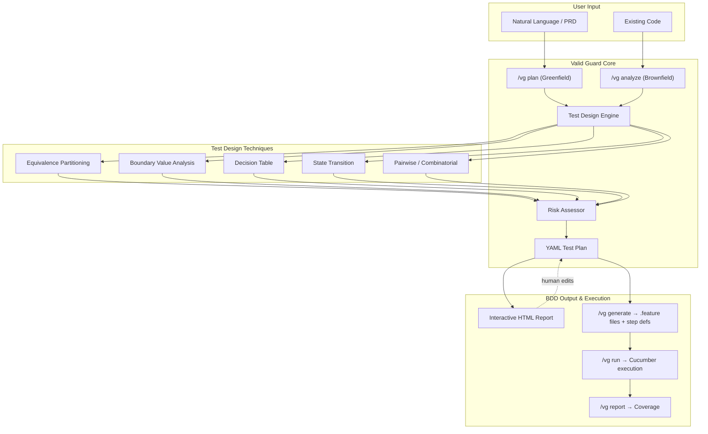

# Valid Guard

**Your LLM already knows testing theory. This skill makes it apply that knowledge as BDD scenarios you can review, approve, and trace --- before any code is written.**

---

## The Problem

AI writes code fast --- but humans lose control.

When an AI coding agent generates a feature, it typically throws in a handful of tests and calls it done. There is no structured plan a human can review, no risk-weighted coverage analysis, and no traceability from requirement to test. The result: humans have no visibility into what is actually being tested, edge cases slip through, and "100% line coverage" masks gaping scenario gaps.

BDD/Gherkin is the industry standard for expressing test scenarios in human-readable language. But writing good Gherkin is only part of the problem. Typical BDD workflows rely on the team to decide *which* scenarios to write, without systematic risk assessment, technique selection, or coverage gap analysis. Meanwhile, TDD-focused skills enforce a red-green-refactor *process* but do not address the *design* of the tests themselves.

## The Solution

Valid Guard is a **BDD-enhanced test design skill** for Claude Code. It adds risk assessment, technique selection, and scenario coverage metrics **on top of** the BDD/Gherkin ecosystem --- keeping humans in control of what gets tested and why.

The skill applies established testing techniques --- equivalence partitioning, boundary value analysis, decision tables, state transition testing, and pairwise combinatorics --- to produce a **YAML test plan** that you review and approve. Once approved, the plan drives Gherkin `.feature` files and step definitions that execute via Cucumber.

```
  AI generates feature code
         |
         v
  +-----------------------------+
  |  /vg plan or /vg analyze    |  <- AI applies testing theory
  +-------------+---------------+
                v
  +-----------------------------+
  |  YAML Test Plan             |  <- Structured, reviewable artifact
  |  * Risk-annotated           |     (risk, techniques, coverage)
  |  * Technique-justified      |
  |  * Scenario-traceable       |
  +-------------+---------------+
                v
  +-----------------------------+
  |  /vg review                 |  <- HUMAN reviews, approves, adjusts
  |  (Interactive HTML)         |     <- This is the HITL checkpoint
  +-------------+---------------+
                v
  +-----------------------------+
  |  /vg generate               |  <- AI writes Gherkin .feature files
  |  Gherkin .feature files     |     and step definitions
  +-------------+---------------+
                v
  +-----------------------------+
  |  /vg run + /vg report       |  <- Cucumber execution and coverage
  +-----------------------------+
```

**Without Valid Guard**: AI decides what to test -> writes code -> human sees tests only at code review (too late to influence design).

**With Valid Guard**: AI proposes what to test -> **human reviews and approves the plan** -> AI writes Gherkin scenarios and step definitions that map 1:1 to the approved plan.

## Key Differentiators

| Aspect | Typical BDD (Cucumber/Gherkin) | Typical TDD Skill | Valid Guard |
|---|---|---|---|
| Focus | Scenario expression (Given/When/Then) | Process (red-green-refactor) | Test *design* (scenario completeness) |
| Scenario selection | Team decides ad hoc | Not addressed | Systematic (5 techniques applied) |
| Risk assessment | Not built-in | Not built-in | **Risk weighting** across 4 dimensions |
| Technique selection | Manual, implicit | Not applied | **Auto-selected** per scenario (EP, BVA, DT, ST, PW) |
| Coverage metric | Scenario count (unweighted) | Line/branch coverage | **Scenario coverage** weighted by risk |
| Test planning | Feature files are the plan | None --- jumps straight to code | YAML plan with risk levels and technique tags |
| Human review | Feature files are reviewable | Code review only | Interactive HTML report *before* code generation |
| Output format | .feature files | Test code | YAML plan -> .feature files -> step definitions -> Cucumber |
| Entry points | Greenfield only | Greenfield only | Greenfield (`/vg plan`) **and** brownfield (`/vg analyze`) |

## Features

- **Greenfield planning** (`/vg plan`) --- from a natural-language description or PRD file, generate a comprehensive test plan using Example Mapping
- **Brownfield analysis** (`/vg analyze`) --- reverse-engineer scenarios from existing code, tracing cross-function call chains, data flow, and state changes up to Level 3 depth
- **Test technique auto-selection** --- AI picks the right technique(s) per scenario based on heuristics (ranges -> boundary value, multiple conditions -> decision table, lifecycle -> state transition, etc.)
- **Risk assessment** --- every scenario is annotated with a risk level (high/medium/low) across four dimensions: impact scope, usage frequency, failure consequence, and detectability
- **YAML test plans** --- machine-readable, version-controllable, human-reviewable test plan artifacts
- **Gherkin output** (`/vg generate`) --- AI produces `.feature` files and Cucumber step definitions from the approved YAML plan, with 1:1 mapping between plan scenarios and Gherkin scenarios via `gherkin_ref`
- **Interactive HTML reports** --- collapsible scenario trees, approve/reject checkboxes, risk-level dropdowns, links to .feature files, Example Mapping and Decision Table visualizations
- **Test execution** (`/vg run`) --- AI-guided: the LLM runs the generated tests via Cucumber and collects results
- **Scenario coverage** (`/vg report`) --- AI-guided: the LLM generates a combined report of scenario coverage (weighted by risk) alongside traditional line coverage
- **Quick status** (`/vg status`) --- at-a-glance coverage summary without generating a full report

## Quick Start

### Installation

Valid Guard is a [Claude Code skill](https://docs.anthropic.com/en/docs/claude-code/skills) --- a prompt-based instruction file that teaches Claude Code new capabilities. It is not a standalone CLI tool or library; it works inside Claude Code's chat interface.

```bash
# 1. Clone this repository
git clone https://github.com/yuweichang1990/valid-guard.git

# 2. Copy the skill into your project's Claude Code skills directory
mkdir -p your-project/.claude/skills
cp -r valid-guard/.claude/skills/valid-guard your-project/.claude/skills/valid-guard

# 3. Verify installation
ls your-project/.claude/skills/valid-guard/SKILL.md
```

If the file exists, Valid Guard is installed. Restart Claude Code and type `/vg plan "your feature description"` in the Claude Code chat interface.

### Prerequisites

- **Claude Code** with skills support (the skill is auto-discovered from `.claude/skills/`)
- Python 3.10+ and pytest (for test execution)
- A Cucumber-compatible BDD framework: `behave` (Python), `cucumber-js` (JavaScript), `cucumber-jvm` (Java), etc.

## Usage

### Greenfield: Create a test plan from a description

```
/vg plan "User authentication with email and password, including login, logout, password reset, and account lockout after 5 failed attempts"
```

Or from a PRD file:

```
/vg plan --prd docs/auth-feature.md
```

This produces a YAML test plan in `valid-guard/plans/`. Run `/vg review` to generate an interactive HTML report for the plan.

### Brownfield: Analyze existing code

```
/vg analyze src/services/payment.py
```

Valid Guard reverse-engineers scenarios from the existing code, identifies coverage gaps, and generates a test plan for uncovered paths.

### Review the test plan

```
/vg review
```

Opens the interactive HTML report where you can:
- Approve or reject individual scenarios
- Adjust risk levels
- Add missing scenarios
- Link scenarios to Gherkin .feature files

### Generate Gherkin scenarios and step definitions

```
/vg generate
```

AI-guided: the LLM reads your YAML test plan and produces Gherkin `.feature` files in your project's `features/` directory and Cucumber step definitions in `tests/`, with each scenario mapped to a plan scenario via `gherkin_ref`. The LLM does the code generation following SKILL.md instructions --- there is no standalone code generator.

### Run tests

```
/vg run
```

AI-guided: the LLM invokes Cucumber and collects pass/fail results. This is a convenience command --- it runs the same tests you could run manually.

### Full coverage report

```
/vg report
```

AI-guided: the LLM generates a combined report showing:
- Scenario coverage (covered / total, weighted by risk)
- Line-of-code coverage
- Uncovered high-risk scenarios highlighted

### Quick status check

```
/vg status
```

Prints a one-line summary: `Scenario coverage: 18/23 (78%) | High-risk uncovered: 2 | Line coverage: 85%`

## Architecture



## Test Plan YAML Format

Test plans are stored in `valid-guard/plans/` as YAML files. Each plan follows this structure:

```yaml
feature: "User Authentication"
risk_level: high
scenarios:
  - name: "Successful login with valid credentials"
    type: happy_path
    risk: high
    risk_rationale: "Impact: 3, Frequency: 3, Consequence: 3, Detectability: 1. Average: 2.50 -> high."
    techniques: [equivalence_partitioning]
    gherkin_ref: "features/auth/user-authentication.feature::Successful login with valid credentials"
    status: covered
    tags: [smoke, critical-path]

  - name: "Account lockout after failed login attempts"
    type: state_transition
    risk: high
    risk_rationale: "Impact: 3, Frequency: 2, Consequence: 3, Detectability: 3. Average: 2.75 -> high."
    techniques: [state_transition, boundary_value]
    gherkin_ref: "features/auth/user-authentication.feature::Account lockout after failed login attempts"
    status: covered
    tags: [security, state-machine, brute-force]

  - name: "Refresh token reuse detection (rotation)"
    type: security
    risk: high
    risk_rationale: "Impact: 3, Frequency: 1, Consequence: 3, Detectability: 3. Average: 2.50 -> high."
    techniques: [error_guessing, state_transition]
    gherkin_ref: ""
    status: uncovered
    tags: [security, tokens, critical-path]

metadata:
  created_at: "2026-03-14T10:00:00Z"
  updated_at: "2026-03-14T10:00:00Z"
  created_by: "valid-guard/v0.2"
  language: "python"
  bdd_framework: "cucumber"
```

The corresponding Gherkin `.feature` file generated from this plan:

```gherkin
@feature:user-authentication @risk:high
Feature: User Authentication
  Authentication system supporting email/password login, account lockout
  after failed attempts, and session management with refresh tokens.

  @risk:high @technique:ep @smoke @critical-path
  Scenario: Successful login with valid credentials
    Given a registered active user with email "alice@example.com"
    And the stored password is "Str0ng!Pass#42"
    When the user logs in with email "alice@example.com" and password "Str0ng!Pass#42"
    Then the response status should be 200
    And the response should include a "Bearer" access token
    And the response should include a refresh token

  @risk:high @technique:st @technique:bva @security @state-machine @brute-force
  Scenario Outline: Account lockout after failed login attempts
    Given an active user account
    And <previous_failures> consecutive failed login attempts
    When the user attempts to log in with a <credential> password
    Then the account state should be "<expected_state>"

    Examples: Lockout boundaries
      | previous_failures | credential | expected_state |
      | 4                 | wrong      | locked         |
      | 4                 | correct    | active         |
      | 2                 | wrong      | active         |
```

### Fields

| Field | Description |
|---|---|
| `feature` | Feature name |
| `risk_level` | Overall feature risk (`high`, `medium`, `low`) |
| `scenarios[].name` | Human-readable scenario description |
| `scenarios[].type` | `happy_path`, `edge_case`, `error_handling`, `boundary`, `security`, `state_transition`, `combinatorial`, `performance` |
| `scenarios[].risk` | Scenario-level risk |
| `scenarios[].risk_rationale` | Risk assessment across 4 dimensions (impact, frequency, consequence, detectability) |
| `scenarios[].techniques` | Testing techniques applied |
| `scenarios[].gherkin_ref` | Link to generated Gherkin scenario (`""` if uncovered, e.g. `features/auth/user-authentication.feature::Successful login with valid credentials`) |
| `scenarios[].status` | `uncovered`, `covered`, `failing`, `skipped` |
| `scenarios[].tags` | Labels for filtering and grouping (e.g. `smoke`, `security`, `critical-path`) |
| `metadata.bdd_framework` | BDD framework used for execution (e.g. `Cucumber`) |

## Scenario Coverage Metric

Valid Guard introduces **scenario coverage** as a first-class metric:

```
Feature PRD
  +-- Epic / User Story
       +-- Scenario (via Example Mapping)
            +-- Rule 1
            |    +-- Example 1.1 (happy path)  -> [risk: high]   -> test_xxx (pass)
            |    +-- Example 1.2 (edge case)   -> [risk: medium] -> test_yyy (pass)
            |    +-- Example 1.3 (boundary)    -> [risk: high]   -> uncovered
            +-- Rule 2 ...
```

- **Scenario coverage** = covered scenarios / total scenarios
- **Weighted scenario coverage** = sum of covered risk weights / sum of total risk weights
- Both metrics are reported alongside traditional line coverage

## Interactive HTML Report

The HTML report provides a visual, interactive view of the test plan:

- Collapsible scenario tree organized by feature and rule
- Approve/reject toggles per scenario
- Risk level dropdowns for adjustment
- Example Mapping visualization
- Decision Table visualization
- Links to generated .feature files and step definitions
- Export to JSON for AI round-trip updates

For a complete end-to-end example, see the [demo/](demo/) directory which includes a sample YAML test plan for a user registration feature.

## Risk Assessment

Every scenario is assessed across four dimensions:

| Dimension | High | Medium | Low |
|---|---|---|---|
| Impact scope | Core business, payments, security | Secondary features, UX | Display-only, cosmetic |
| Usage frequency | Every user daily | Some users occasionally | Rarely triggered |
| Failure consequence | Data loss, security breach, money | Functional but workaround exists | Minor inconvenience |
| Detectability | Silent failure (user won't notice) | User notices but not severe | Immediately visible |

## File Structure

### This repository (what you clone)

```
valid-guard/                       # This repo
+-- .claude/skills/valid-guard/    # The skill itself
|   +-- SKILL.md                   #   Core skill definition (LLM instructions)
|   +-- assets/                    #   Report template, default config
|   +-- references/                #   Techniques guide, schema, anti-patterns
|   +-- examples/                  #   3 example YAML plans + .feature files
|       +-- user-authentication.yaml
|       +-- user-authentication.feature
|       +-- e-commerce-checkout.yaml
|       +-- e-commerce-checkout.feature
|       +-- file-upload-api.yaml
|       +-- file-upload-api.feature
+-- evals/                         # Eval suite (30 cases, grading, reports)
+-- demo/                          # End-to-end demo with sample YAML plan
+-- .github/                       # Issue templates, PR template, CI workflow
+-- DESIGN.md                      # Design decisions document
+-- CONTRIBUTING.md                # Contributor guide
+-- CHANGELOG.md                   # Release history
+-- README.md                      # This file
```

### Your project (created at runtime by `/vg` commands)

```
your-project/
+-- .claude/skills/valid-guard/    # Copied from this repo during installation
+-- valid-guard/
|   +-- plans/                     # YAML test plans (version-controlled)
|   +-- reports/                   # Interactive HTML reports (gitignored)
|   +-- config.yaml                # Valid Guard configuration
+-- features/                      # Generated Gherkin .feature files
+-- tests/                         # Generated step definitions and test code
```

## Benchmark Results

Valid Guard was evaluated on **30 eval cases** across 11 categories, measuring two dimensions of value:

1. **Content improvement** --- Does the skill help the LLM include more testing concepts (techniques, edge cases, risk analysis)?
2. **Structured output** --- Does the skill reliably produce human-readable, reviewable YAML test plans?

**Baseline**: The "without skill" column is a bare LLM with no instructions. This is not a comparison against an alternative tool or methodology; it measures what SKILL.md adds over a zero-context starting point.

### 1. Content Improvement: +10.1% average (30 evals)

| Category | with_skill | without_skill | Content Delta |
|---|---|---|---|
| Security | 100.0% | 54.5% | **+45.5%** |
| Brownfield | 100.0% | 74.6% | **+25.4%** |
| Adversarial | 100.0% | 84.5% | **+15.5%** |
| Code Gen | 100.0% | 87.3% | **+12.7%** |
| Concurrency | 100.0% | 90.9% | **+9.1%** |
| TDD Best Practices | 100.0% | 90.9% | **+9.1%** |
| Risk Assessment | 100.0% | 90.9% | **+9.1%** |
| State Transition | 100.0% | 92.4% | **+7.6%** |
| Domain Specific | 100.0% | 92.7% | **+7.3%** |
| Correctness | 100.0% | 98.2% | **+1.8%** |
| Completeness | 100.0% | 100.0% | **+0.0%** |
| **Average** | **100.0%** | **89.9%** | **+10.1%** |

> The bare LLM already scores ~90% on test design content. The +10.1% improvement is concentrated in specialized categories where structured technique application matters most: security (+45.5%), brownfield (+25.4%), adversarial (+15.5%).

### 2. Structured, Human-Readable Output: 99.2% schema compliance

The skill's primary value is not just what it knows, but **how it presents it**. Every test plan includes:
- **Risk rationale** across 4 dimensions (impact, frequency, consequence, detectability)
- **Technique tags** indicating why each testing technique was selected
- **Example mapping** with concrete input/expected pairs
- **Decision tables** for multi-condition scenarios
- **Gherkin output** with `.feature` files ready for Cucumber execution
- **Status tracking** for workflow integration

This structured format makes test plans **reviewable by humans before code is generated** --- a capability bare LLM output does not provide in any consistent format.

| Metric | Score |
|---|---|
| Schema compliance rate (22 plan-type evals) | **99.2%** |

> Schema compliance is an internal quality metric, not a comparative benchmark. It confirms the skill reliably produces its own structured format --- the bare LLM has no knowledge of this schema, so comparing against it would be circular.

### What This Benchmark Does NOT Measure

- **Real-world test effectiveness**: Whether the generated test plans actually catch more bugs than alternatives
- **Comparison to other tools**: The baseline is "no instructions at all," not a competing methodology like BDD or manual test planning
- **Human expert agreement**: Scores are pattern-match-based, not validated against human test designers
- **Test code correctness**: Only 2 of 30 evals test `/vg generate` output, and generated code was not executed
- **Statistical significance**: Each eval was run once; LLM non-determinism means scores may vary by several percentage points

### Token Efficiency

| Metric | with_skill | without_skill | Ratio |
|---|---|---|---|
| Avg tokens / eval | ~50,000 | ~23,000 | 2.1x |
| Avg duration / eval | ~4 min | ~2 min | 2.1x |

The skill uses **2.1x more tokens** than bare LLM, primarily for reading SKILL.md (~500 lines) and generating structured YAML with all mandatory schema fields. The overhead reflects output completeness (risk rationale, technique tags, state transitions, decision tables, example mapping, metadata).

### Methodology

- 30 eval cases: 28 from a 187-case eval library, 2 custom with real Python code fixtures
- 11 categories: correctness, completeness, brownfield, codegen, adversarial, state_transition, domain_specific, tdd_best_practices, risk_assessment, concurrency, security
- Grading: rubric-based regex pattern matching with weighted scoring
- Each eval run as independent agent with or without SKILL.md context
- Self-evaluated: designed and graded by the same team that built the skill
- Full results: [`evals/RESULTS.md`](evals/RESULTS.md) | Interactive report: [`evals/report.html`](evals/report.html)

## Language Support

- **Gherkin .feature files**: Language-agnostic. The same `.feature` file works with any Cucumber implementation.
- **Step definitions**: Generated for your project's language. Currently supported: Python (behave). Architecture supports any language via `language` + `bdd_framework` config.
- **Language detection**: Checks for `pyproject.toml`, `package.json`, `go.mod`, etc.

## How It Compares

| Aspect | Valid Guard | Manual Planning (spreadsheets, Jira) | BDD / Gherkin (standalone) | Property-Based Testing (Hypothesis) | No Planning (just write tests) |
|---|---|---|---|---|---|
| **Setup cost** | Low (copy skill, restart Claude) | High (templates, process) | Medium (tooling, step defs) | Medium (learning curve) | None |
| **Scenario completeness** | Systematic (5 techniques applied) | Depends on tester expertise | Good if team is disciplined | Excellent for input spaces | Ad hoc, varies widely |
| **Risk annotation** | Built-in (4 dimensions) | Manual, often skipped | Not built-in | Not applicable | None |
| **Technique selection** | Auto-selected per scenario | Manual, implicit | Manual, implicit | N/A (property strategies) | None |
| **Human review** | YAML plan + HTML report before code | Spreadsheet / ticket review | Feature files are reviewable | Strategies are reviewable | Code review only |
| **Works without AI** | No (requires Claude Code) | Yes | Yes | Yes | Yes |
| **Executable output** | .feature files + step defs via Cucumber | Manual test writing | Executable via runner | Executable directly | Executable directly |
| **Edge case discovery** | Good (BVA, pairwise) | Depends on tester | Weak (manual examples) | **Excellent** (random generation) | Poor |
| **Regression detection** | Tracks scenario status | Manual tracking | Good (living docs) | **Excellent** (shrinking) | Depends on coverage |
| **Team scalability** | Tied to Claude Code users | Any team | Any team | Developers only | Any developer |

**Where alternatives are better**: Property-based testing finds edge cases humans and LLMs miss. Standalone BDD/Gherkin is a proven collaboration tool between technical and non-technical stakeholders. Manual planning works without any tooling dependency. "Just write tests" has zero overhead for experienced developers who already think systematically.

**Where Valid Guard enhances BDD**: Valid Guard does not replace BDD --- it enhances it. Standalone BDD relies on the team to decide which scenarios to write. Valid Guard adds the *design layer* that BDD lacks: systematic technique selection, risk-weighted coverage analysis, and a structured YAML plan that drives Gherkin output. The result is BDD with the rigor of formal test design.

## Glossary

| Term | Definition |
|---|---|
| **Scenario coverage** | The ratio of test-covered scenarios to total identified scenarios, optionally weighted by risk level. Complements line/branch coverage by measuring *what* is tested, not just *how much code* is executed. |
| **Brownfield** | Analyzing existing code to derive test scenarios. Contrast with greenfield (starting from a description or PRD). |
| **Greenfield** | Creating a test plan from scratch based on a feature description or requirements document, before code exists. |
| **Example Mapping** | A technique for deriving test scenarios from rules: each rule produces concrete examples (happy path, edge cases, boundaries) that become test cases. |
| **Risk dimensions** | Four axes used to assess each scenario: **impact scope** (what breaks), **usage frequency** (how often triggered), **failure consequence** (severity of failure), **detectability** (how quickly failures are noticed). |
| **EP (Equivalence Partitioning)** | Dividing inputs into groups (partitions) that should behave the same way, then testing one representative from each group. |
| **BVA (Boundary Value Analysis)** | Testing at the edges of equivalence partitions (min, max, just inside, just outside) where bugs cluster. |
| **DT (Decision Table)** | Enumerating all combinations of conditions and their expected outcomes. Useful when multiple boolean conditions interact. |
| **ST (State Transition)** | Modeling a system as states and transitions, then testing valid and invalid state changes (e.g., account lockout after N failures). |
| **PW (Pairwise / Combinatorial)** | Testing all pairs of parameter values rather than all combinations, reducing test count while covering interaction effects. |
| **BDD (Behavior-Driven Development)** | A development approach where expected behavior is specified as Given/When/Then scenarios in Gherkin syntax, bridging communication between stakeholders and developers. |
| **Gherkin** | A structured natural language format (Given/When/Then) for writing executable specifications, stored in `.feature` files. |
| **Cucumber** | A BDD framework family that executes Gherkin `.feature` files by mapping steps to functions (step definitions). Implementations: `behave` (Python), `cucumber-js` (JS/TS), `cucumber-jvm` (Java), `cucumber` (Ruby), `godog` (Go). |

## Contributing

Contributions are welcome. See [CONTRIBUTING.md](CONTRIBUTING.md) for development setup, eval suite instructions, code conventions, and the pull request process.

## License

[MIT](LICENSE) --- Copyright 2026 Slippers Chang
