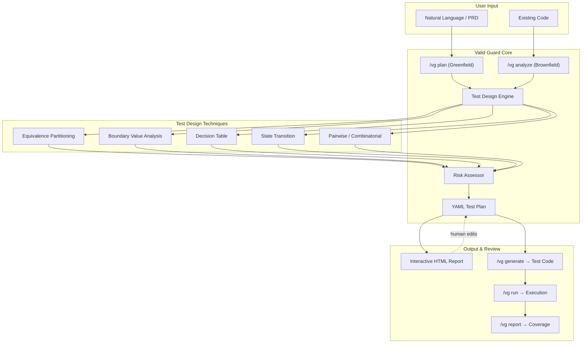

# Valid Guard

**AI-age test design intelligence for Claude Code**

---

## The Problem

AI writes code fast --- but tests are lazy.

When an AI coding agent generates a feature, it typically throws in a handful of tests and calls it done. There is no systematic test design, no risk-weighted coverage analysis, and no structured plan a human can review before test code is generated. The result: humans lose visibility into what is actually being tested, edge cases slip through, and "100% line coverage" masks gaping scenario gaps.

Current TDD-focused skills enforce a red-green-refactor *process*, but they do not address the *design* of the tests themselves. Writing tests first does not help if the tests are shallow.

## The Solution

Valid Guard brings **software testing theory** into AI-assisted development. It applies established techniques --- equivalence partitioning, boundary value analysis, decision tables, state transition testing, and pairwise combinatorics --- to systematically derive test scenarios before any test code is written.

The workflow is:

1. **Define** --- describe the feature or point at existing code
2. **Plan** --- Valid Guard produces a structured YAML test plan with risk-annotated scenarios
3. **Review** --- inspect and adjust via an interactive HTML report
4. **Generate** --- produce test code that maps 1:1 to the plan
5. **Verify** --- run tests and get a combined scenario + line coverage report

## Key Differentiators

| Aspect | Typical TDD Skill | Valid Guard |
|---|---|---|
| Focus | Process (red-green-refactor) | Test *design* (scenario completeness) |
| Coverage metric | Line/branch coverage | **Scenario coverage** weighted by risk |
| Test planning | None --- jumps straight to code | YAML test plan with risk levels and technique tags |
| Human review | Code review only | Interactive HTML report *before* code generation |
| Testing theory | Not applied | Equivalence partitioning, boundary value, decision tables, state transition, pairwise |
| Entry points | Greenfield only | Greenfield (`/vg plan`) **and** brownfield (`/vg analyze`) |

## Features

- **Greenfield planning** (`/vg plan`) --- from a natural-language description or PRD file, generate a comprehensive test plan using Example Mapping
- **Brownfield analysis** (`/vg analyze`) --- reverse-engineer scenarios from existing code, tracing cross-function call chains, data flow, and state changes up to Level 3 depth
- **Test technique auto-selection** --- AI picks the right technique(s) per scenario based on heuristics (ranges -> boundary value, multiple conditions -> decision table, lifecycle -> state transition, etc.)
- **Risk assessment** --- every scenario is annotated with a risk level (high/medium/low) across four dimensions: impact scope, usage frequency, failure consequence, and detectability
- **YAML test plans** --- machine-readable, version-controllable, human-reviewable test plan artifacts
- **Interactive HTML reports** --- collapsible scenario trees, approve/reject checkboxes, risk-level dropdowns, links to test code, Example Mapping and Decision Table visualizations
- **Test code generation** (`/vg generate`) --- AI-guided: the LLM produces test code (Python + pytest for MVP) following SKILL.md instructions, with 1:1 mapping to plan scenarios
- **Test execution** (`/vg run`) --- AI-guided: the LLM runs the generated tests via your project's test runner and collects results
- **Scenario coverage** (`/vg report`) --- AI-guided: the LLM generates a combined report of scenario coverage (weighted by risk) alongside traditional line coverage
- **Quick status** (`/vg status`) --- at-a-glance coverage summary without generating a full report

## Quick Start

### Installation

Valid Guard is a Claude Code skill. To install it in your project:

```bash
# 1. Clone this repository
git clone <this-repo-url> valid-guard-repo

# 2. Copy the skill into your project's Claude Code skills directory
mkdir -p your-project/.claude/skills
cp -r valid-guard-repo/.claude/skills/valid-guard your-project/.claude/skills/valid-guard

# 3. Verify installation
ls your-project/.claude/skills/valid-guard/SKILL.md
```

If the file exists, Valid Guard is installed. Restart Claude Code and the `/vg` commands will be available.

### Prerequisites

- **Claude Code v2.1.3 or later** (skills support required; older versions will silently ignore the skill)
- Python 3.10+ and pytest (for MVP test execution)

## Usage

### Greenfield: Create a test plan from a description

```
/vg plan "User authentication with email and password, including login, logout, password reset, and account lockout after 5 failed attempts"
```

Or from a PRD file:

```
/vg plan --prd docs/auth-feature.md
```

This produces a YAML test plan in `valid-guard/plans/` and opens an interactive HTML report.

### Brownfield: Analyze existing code

```
/vg analyze src/services/payment.py
```

Valid Guard reverse-engineers scenarios from the existing code, identifies coverage gaps, and generates a test plan for uncovered paths.

### Review the test plan

```
/vg review
```

Opens the interactive HTML report where you can:
- Approve or reject individual scenarios
- Adjust risk levels
- Add missing scenarios
- Link scenarios to existing test code

### Generate test code

```
/vg generate
```

AI-guided: the LLM reads your YAML test plan and produces pytest test files in your project's `tests/` directory, with each test function mapped to a plan scenario via `test_ref`. The LLM does the code generation following SKILL.md instructions --- there is no standalone code generator.

### Run tests

```
/vg run
```

AI-guided: the LLM invokes your project's test runner (e.g., `pytest`) and collects pass/fail results. This is a convenience command --- it runs the same tests you could run manually.

### Full coverage report

```
/vg report
```

AI-guided: the LLM generates a combined report showing:
- Scenario coverage (covered / total, weighted by risk)
- Line-of-code coverage
- Uncovered high-risk scenarios highlighted

### Quick status check

```
/vg status
```

Prints a one-line summary: `Scenario coverage: 18/23 (78%) | High-risk uncovered: 2 | Line coverage: 85%`

## Architecture



## Test Plan YAML Format

Test plans are stored in `valid-guard/plans/` as YAML files. Each plan follows this structure:

```yaml
feature: User Authentication
risk_level: high
scenarios:
  - name: "Successful login with valid credentials"
    type: happy_path
    risk: high
    techniques: [equivalence_partitioning]
    examples:
      - input: { email: "valid@test.com", password: "Valid123!" }
        expected: { status: 200, token: "non-empty" }
    test_ref: "tests/auth/test_login.py::test_successful_login"
    status: covered

  - name: "Login fails after 5 consecutive bad passwords"
    type: edge_case
    risk: high
    techniques: [boundary_value_analysis, state_transition]
    examples:
      - input: { email: "user@test.com", attempts: 5 }
        expected: { status: 423, locked: true }
    test_ref: null
    status: uncovered
```

### Fields

| Field | Description |
|---|---|
| `feature` | Feature name |
| `risk_level` | Overall feature risk (`high`, `medium`, `low`) |
| `scenarios[].name` | Human-readable scenario description |
| `scenarios[].type` | `happy_path`, `edge_case`, `error_case`, `boundary`, `security` |
| `scenarios[].risk` | Scenario-level risk |
| `scenarios[].techniques` | Testing techniques applied |
| `scenarios[].examples` | Concrete input/expected pairs |
| `scenarios[].test_ref` | Link to generated test function (null if uncovered) |
| `scenarios[].status` | `covered`, `uncovered`, `approved`, `rejected` |

## Scenario Coverage Metric

Valid Guard introduces **scenario coverage** as a first-class metric:

```
Feature PRD
  └── Epic / User Story
       └── Scenario (via Example Mapping)
            ├── Rule 1
            │    ├── Example 1.1 (happy path)  → [risk: high]   → test_xxx ✓
            │    ├── Example 1.2 (edge case)   → [risk: medium] → test_yyy ✓
            │    └── Example 1.3 (boundary)    → [risk: high]   → ✗ uncovered
            └── Rule 2 ...
```

- **Scenario coverage** = covered scenarios / total scenarios
- **Weighted scenario coverage** = sum of covered risk weights / sum of total risk weights
- Both metrics are reported alongside traditional line coverage

## Interactive HTML Report

The HTML report provides a visual, interactive view of the test plan:

- Collapsible scenario tree organized by feature and rule
- Approve/reject toggles per scenario
- Risk level dropdowns for adjustment
- Example Mapping visualization
- Decision Table visualization
- Links to generated test code
- Export to JSON for AI round-trip updates

For a complete end-to-end example, see the [demo/](demo/) directory which includes a sample YAML test plan for a user registration feature.

## Risk Assessment

Every scenario is assessed across four dimensions:

| Dimension | High | Medium | Low |
|---|---|---|---|
| Impact scope | Core business, payments, security | Secondary features, UX | Display-only, cosmetic |
| Usage frequency | Every user daily | Some users occasionally | Rarely triggered |
| Failure consequence | Data loss, security breach, money | Functional but workaround exists | Minor inconvenience |
| Detectability | Silent failure (user won't notice) | User notices but not severe | Immediately visible |

## File Structure

```
project-root/
├── .claude/
│   └── skills/
│       └── valid-guard/        # Skill definition (SKILL.md)
├── .github/                    # Issue templates, PR template, CI workflow
├── valid-guard/
│   ├── plans/                  # Test plans (YAML) — version controlled
│   ├── reports/                # Interactive HTML reports — gitignored
│   ├── templates/              # Report templates — version controlled
│   ├── schema/                 # YAML schema definitions
│   ├── examples/               # Example test plans
│   └── config.yaml             # Valid Guard configuration
├── evals/                      # Eval suite (30 cases, grading, reports)
├── demo/                       # End-to-end demo with sample YAML plan
├── tests/                      # Generated test code (project's test dir)
├── DESIGN.md                   # Design decisions document
├── CONTRIBUTING.md             # Contributor guide
├── CHANGELOG.md                # Release history
└── README.md                   # This file
```

## Benchmark Results

Valid Guard was evaluated on **30 eval cases** across 11 categories. The benchmark measures whether loading SKILL.md causes the LLM to produce outputs that match Valid Guard's expected format and content rubrics.

**Baseline**: The "without skill" column is a bare LLM with no instructions --- no SKILL.md, no prompt, no schema reference. This is not a comparison against an alternative tool or methodology; it measures what SKILL.md adds over a zero-context starting point.

### Summary (30 evals, 11 categories)

| Dimension | with_skill | without_skill | Delta | What it measures |
|---|---|---|---|---|
| **Content** (test design quality) | 100.0% | 89.9% | **+10.1%** | Domain knowledge, technique application, scenario completeness |
| **Schema compliance** (format adherence) | 99.2% | 15.0% | **+84.2%** | Whether output includes Valid Guard YAML fields (risk_rationale, test_ref, metadata, etc.) |

> The +84.2% schema compliance delta is expected: the skill defines a custom YAML schema, so a bare LLM with no knowledge of that schema will naturally score low. This measures format adherence, not test design quality.
>
> The +10.1% content delta is the more meaningful number. The bare LLM already produces reasonable test design content (~90%); the skill adds structured technique application and risk annotation.

#### Content Score by Category

| Category | with_skill | without_skill | Content Delta |
|---|---|---|---|
| Security | 100.0% | 54.5% | **+45.5%** |
| Brownfield | 100.0% | 74.6% | **+25.4%** |
| Adversarial | 100.0% | 84.5% | **+15.5%** |
| Code Gen | 100.0% | 87.3% | **+12.7%** |
| Concurrency | 100.0% | 90.9% | **+9.1%** |
| TDD Best Practices | 100.0% | 90.9% | **+9.1%** |
| Risk Assessment | 100.0% | 90.9% | **+9.1%** |
| State Transition | 100.0% | 92.4% | **+7.6%** |
| Domain Specific | 100.0% | 92.7% | **+7.3%** |
| Correctness | 100.0% | 98.2% | **+1.8%** |
| Completeness | 100.0% | 100.0% | **+0.0%** |

> Note: 100.0% content scores across all categories suggest the rubrics may be too lenient. The rubrics use regex pattern matching, which can over-credit superficial keyword presence. Take per-category scores as directional, not precise.

#### Schema Compliance by Category (plan-type evals only)

| Category | with_skill | without_skill | Delta |
|---|---|---|---|
| All plan-type evals (22) | 99.2% | 15.0% | **+84.2%** |

### What This Benchmark Does NOT Measure

- **Real-world test effectiveness**: Whether the generated test plans actually catch more bugs than alternatives
- **Comparison to other tools**: The baseline is "no instructions at all," not a competing methodology like BDD or manual test planning
- **Human expert agreement**: Scores are pattern-match-based, not validated against human test designers
- **Test code correctness**: Only 2 of 30 evals test `/vg generate` output, and generated code was not executed
- **Statistical significance**: Each eval was run once; LLM non-determinism means scores may vary by several percentage points

### Token Efficiency

| Metric | with_skill | without_skill | Ratio |
|---|---|---|---|
| Avg tokens / eval | ~50,000 | ~23,000 | 2.1x |
| Avg duration / eval | ~4 min | ~2 min | 2.1x |

The skill uses **2.1x more tokens** than bare LLM, primarily for reading SKILL.md (~500 lines) and generating structured YAML with all mandatory schema fields. The overhead reflects output completeness (risk rationale, technique rationale, state transitions, decision tables, example mapping, metadata).

### Methodology

- 30 eval cases: 28 from a 187-case eval library, 2 custom with real Python code fixtures
- 11 categories: correctness, completeness, brownfield, codegen, adversarial, state_transition, domain_specific, tdd_best_practices, risk_assessment, concurrency, security
- Grading: rubric-based regex pattern matching with weighted scoring
- Each eval run as independent agent with or without SKILL.md context
- Self-evaluated: designed and graded by the same team that built the skill
- Full results: [`evals/RESULTS.md`](evals/RESULTS.md) | Interactive report: [`evals/report.html`](evals/report.html)

## Language Support

- **MVP**: Python + pytest
- **Architecture**: The test plan layer is language-agnostic. Code generation detects your project's language by checking for `pyproject.toml`, `package.json`, `go.mod`, etc.

## How It Compares

| Aspect | Valid Guard | Manual Planning (spreadsheets, Jira) | BDD / Gherkin | Property-Based Testing (Hypothesis) | No Planning (just write tests) |
|---|---|---|---|---|---|
| **Setup cost** | Low (copy skill, restart Claude) | High (templates, process) | Medium (tooling, step defs) | Medium (learning curve) | None |
| **Scenario completeness** | Systematic (5 techniques applied) | Depends on tester expertise | Good if team is disciplined | Excellent for input spaces | Ad hoc, varies widely |
| **Risk annotation** | Built-in (4 dimensions) | Manual, often skipped | Not built-in | Not applicable | None |
| **Human review** | YAML plan before code | Spreadsheet / ticket review | Feature files are reviewable | Strategies are reviewable | Code review only |
| **Works without AI** | No (requires Claude Code) | Yes | Yes | Yes | Yes |
| **Executable output** | AI-guided test generation | Manual test writing | Executable via runner | Executable directly | Executable directly |
| **Edge case discovery** | Good (BVA, pairwise) | Depends on tester | Weak (manual examples) | **Excellent** (random generation) | Poor |
| **Regression detection** | Tracks scenario status | Manual tracking | Good (living docs) | **Excellent** (shrinking) | Depends on coverage |
| **Team scalability** | Tied to Claude Code users | Any team | Any team | Developers only | Any developer |

**Where alternatives are better**: Property-based testing finds edge cases humans and LLMs miss. BDD/Gherkin is a proven collaboration tool between technical and non-technical stakeholders. Manual planning works without any tooling dependency. "Just write tests" has zero overhead for experienced developers who already think systematically.

**Where Valid Guard adds value**: It enforces structured test design thinking (technique selection, risk annotation, scenario traceability) at the point where AI is already generating code, rather than requiring a separate process.

## Glossary

| Term | Definition |
|---|---|
| **Scenario coverage** | The ratio of test-covered scenarios to total identified scenarios, optionally weighted by risk level. Complements line/branch coverage by measuring *what* is tested, not just *how much code* is executed. |
| **Brownfield** | Analyzing existing code to derive test scenarios. Contrast with greenfield (starting from a description or PRD). |
| **Greenfield** | Creating a test plan from scratch based on a feature description or requirements document, before code exists. |
| **Example Mapping** | A technique for deriving test scenarios from rules: each rule produces concrete examples (happy path, edge cases, boundaries) that become test cases. |
| **Risk dimensions** | Four axes used to assess each scenario: **impact scope** (what breaks), **usage frequency** (how often triggered), **failure consequence** (severity of failure), **detectability** (how quickly failures are noticed). |
| **EP (Equivalence Partitioning)** | Dividing inputs into groups (partitions) that should behave the same way, then testing one representative from each group. |
| **BVA (Boundary Value Analysis)** | Testing at the edges of equivalence partitions (min, max, just inside, just outside) where bugs cluster. |
| **DT (Decision Table)** | Enumerating all combinations of conditions and their expected outcomes. Useful when multiple boolean conditions interact. |
| **ST (State Transition)** | Modeling a system as states and transitions, then testing valid and invalid state changes (e.g., account lockout after N failures). |
| **PW (Pairwise / Combinatorial)** | Testing all pairs of parameter values rather than all combinations, reducing test count while covering interaction effects. |

## Contributing

Contributions are welcome. See [CONTRIBUTING.md](CONTRIBUTING.md) for development setup, eval suite instructions, code conventions, and the pull request process.

## License

[MIT](LICENSE) --- Copyright 2026
